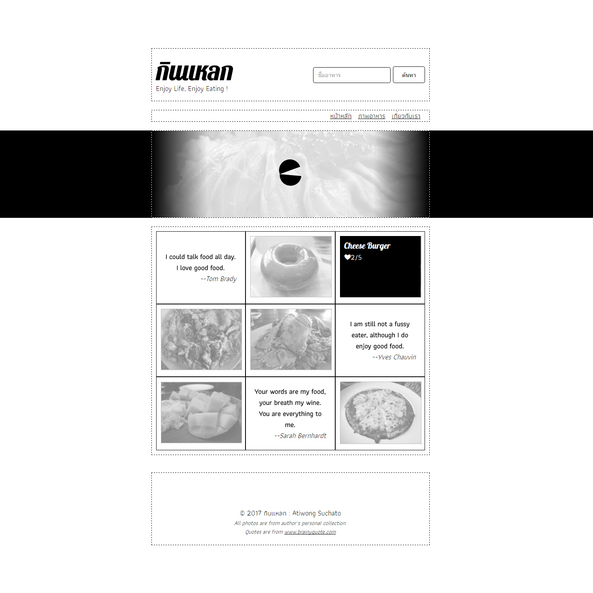

# Homework 1: Basic CSS

In this homework, we are going to make single page website "กินแหลก" by using only basic HTML and CSS **CSS Framework like Bootstrap, Foundation are not allow on this homework at all.**

"กินแหลก" has UI design as shown below.

## Tasks
- Making "กินแหลก" website with site's structure as shown in the design.
- For "กินแหลก" branding logo at the top of page, using ["Pattaya"](https://fonts.google.com/specimen/Pattaya) font.
- Color usage is free to choose. Also the content font.
- Assets like food images are also up to you, But I've provide some of it inside `problem` folder
- **NO CSS FRAMEWORK ALLOWS!**
