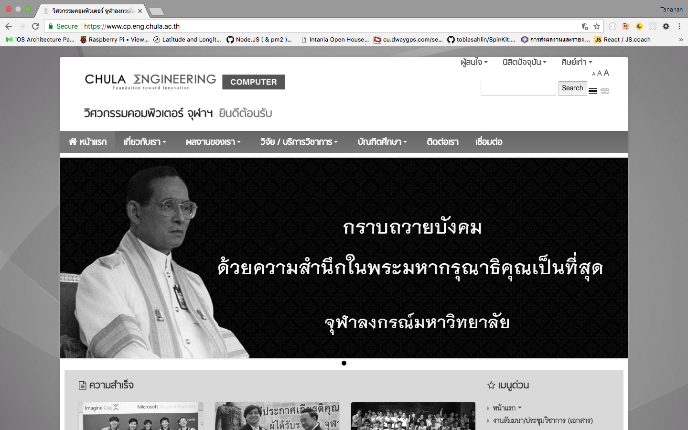

# Homework 2: CSS Framework and Responsive Web Design

In this homework, we are going to *renovate* [Deparment of Computer Engineering, Chulalongkorn University official site](https://www.cp.eng.chula.ac.th/).

*Note: Picture of the site was updated at 8 February 2017, when we still mourn to our King Rama IX. So the website was rendered in grayscale tone. For the page without grayscale tone, visit [this site](https://web.archive.org/web/20161008191343/https://www.cp.eng.chula.ac.th/)*

Take a look of the website by using your smartphone or tablet (Or Chrome inspector and choose responsive view). You will see that the layout doesn't seems good when the screen is too small.

Your task is to **renovate** this website by using [W3CSS](http://www.w3schools.com/w3css/) framework. Make sure that the renovated one is responsive as well. (The terms "responsive" is too wide, the thing you need to be done is depands on your own perspective of "responsive".)

## Tasks
- Renovating Deparment of Computer Engineering, Chulalongkorn University official site to be responsive one.
- I've some image assets provide in `assets/img` folder.
- Using [W3CSS](http://www.w3schools.com/w3css/) as CSS Framework and [FontAwesome](http://fontawesome.io/) for icon in this tasks.
