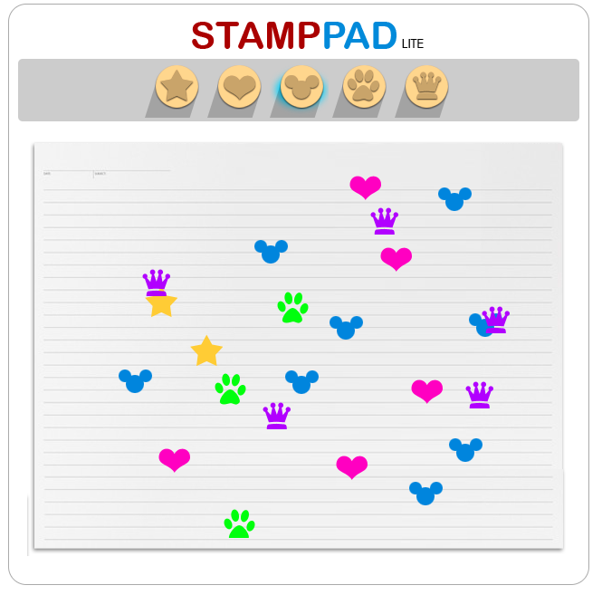

# Homework 3: JavaScript + jQuery

In this homework, we are going to make something that has more interaction with user. We will implements a **"StampPad Lite"** web application. 

StampPad Lite is a simple stamppad web application that user can choose a stamp mark and stamps it on the paper zone. As shown in the picture below.

## Tasks
- Implements "stamp" feature that when user choose a stamp mark, highlight it with `bg_glow.png` file (you can notice the highlight one in above picture on a "Mickey Mouse" stamp mark.), then user can stamp it in the paper plain.
- **Use jQuery** to implementing a feature. (Any version is fine.)
- HTML and CSS are provide in `problem` folder. You are free to edit the source file.
- **Extra Feature:** Make a cursor change respects to selected stamp mark. (It's up to you to implements it or not.)
